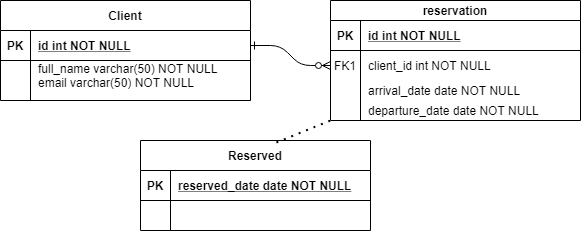
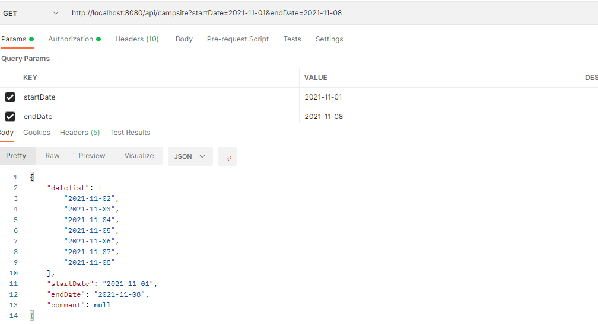

# volcano-campsite

volcano-campsite API is the microservice restful API for volcano campsite reservation.

### Requirement

Please [click link](doc/requirement.md) for detail of business requirement

### Prerequisites

- JDK 11

- Maven 3.8.1+

- SpringBoot

### API design:

#### Backend repository Design

The volcano-campsite API use H2 database as backend repository to save user and reservation information. Since we only design the API to handler one single campsite, the database structure is simple:


| table   | comments        |
| --------|---------------|
| client  | client information, include client name and client email |
| reservation  | reservation detail information. This is the table hold book of records for reservation |
| reserved  | reserved date; This table used to  handle concurrent requests  |
  

By default, when the API start, h2 will start in-memory database testdb and create tables above

```yaml
  datasource:
    url: jdbc:h2:mem:testdb
    username: sa
    password:
    driverClassName: org.h2.Driver
```
The data in the database will disappear after API shutdown. In case if we need keep the data, change the url to use file base h2 database:

    url: jdbc:h2:~/testdb

ER-diagram:


  

#### API Endpoints Design

- Get: /api/campsite           -- List available time for the campsite


- POST: /api/campsite                  --campsite reservation


- Put:  /api/campsite/{orderId}        -- Change reservation


- Delete: /api/campsite/{orderId}      -- Delete reservation

For the detail, please refer to the openapi spec [here](src/main/resources/openapi.yaml)


For detail work sequence, please refer [here](doc/workflow.md) 

### Local build

There are several ways to start API:

- From IDE, run the /src/main/java/com/mservicetech/campsite/CampsiteApplication.java

- Start from command line:

```text
cd /workspace/volcano-campsite
mvn clean install
java -jar target/volcano-0.0.1-SNAPSHOT.jar
```

- Start from local docker environment

From the API root folder, run docker command:
```yaml
docker build -t volcano/campsite .
docker run -p 8080:8080 volcano/campsite
```
  

### API  verification

Swagger ui:  http://localhost:8080/swagger-ui.html

API health check:   http://localhost:8080/actuator/health

We can use postman to send https request to test the API:




For detail test cases, please refer the [test cases](doc/test_cases.md) document

### Performance 


//TODO

